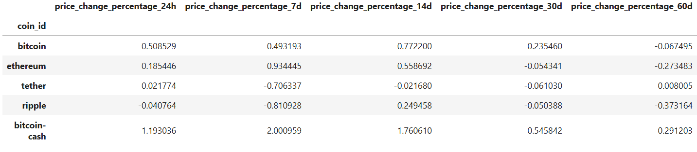
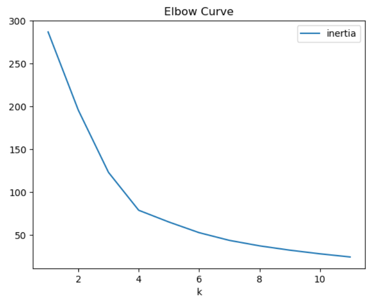
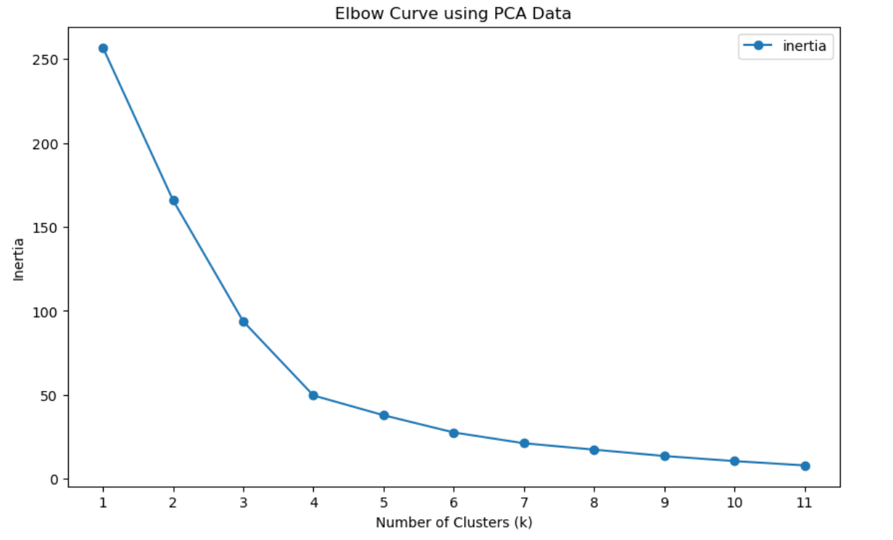
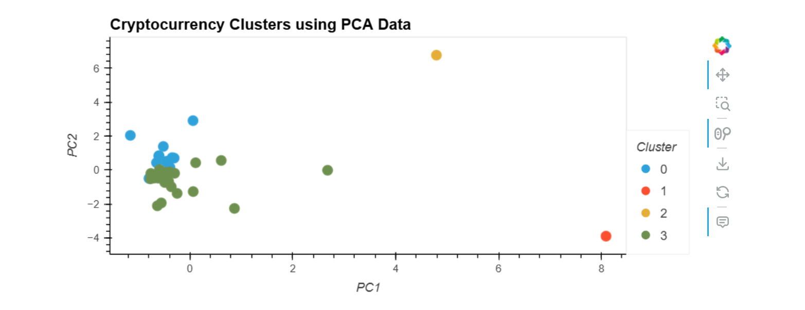
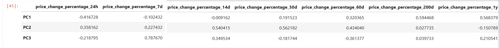

# Cryptocurrency Clustering Assignment
Class Module 11 Challenge
## Overview

This project aims to analyze and cluster cryptocurrencies using K-means clustering. The data is processed and reduced using Principal Component Analysis (PCA) to find patterns and group cryptocurrencies based on their price changes over different time frames.

## Table of Contents

- [Data Source](#data-source)
- [Libraries Used](#libraries-used)
- [Data Preprocessing](#data-preprocessing)
- [Clustering](#clustering)
- [Principal Component Analysis (PCA)](#principal-component-analysis-pca)
- [Results](#results)
- [Conclusions](#conclusions)

## Data Source

The dataset used for this assignment contains information about various cryptocurrencies, including their price changes over different periods (24h, 7d, 14d, etc.).

## Libraries Used

- `pandas`: For data manipulation and analysis.
- `numpy`: For numerical computations.
- `matplotlib`: For plotting graphs.
- `scikit-learn`: For implementing K-means clustering and PCA.
- `hvPlot`: For interactive plotting.

## Data Preprocessing

- **Load the data**: Import the cryptocurrency dataset.
- **Normalize the data**: Use `StandardScaler` from `scikit-learn` to normalize the data.
- **Create a DataFrame**: Store the scaled data, along with the original crypto names.

### 1. Scaling the data

### 2. Finding the Best Value for k
- The Elbow Method was used to determine the optimal number of clusters (k) for K-means clustering.
  

## Clustering

1. **Determine the best value for k**: Use the elbow method to identify the optimal number of clusters for the original scaled data.
2. **Fit the K-Means model**: Initialize and fit the model using the best value for k.
3. **Predict clusters**: Assign clusters to cryptocurrencies and visualize them using scatter plots.

## Principal Component Analysis (PCA)

1. **Reduce dimensions**: Perform PCA on the scaled data to reduce features to three principal components.
2. **Determine explained variance**: Analyze how much information each principal component captures.
3. **Clustering with PCA data**: Use the elbow method again on the PCA data to find the best value for k and cluster the cryptocurrencies.

- Principal Component Analysis (PCA) was applied to reduce the dimensionality of the data to three principal components.

### 3. Feature Influence on Principal Components
- The weights of each feature on the principal components were analyzed to understand their influence.

- The clustering results for both original and PCA-reduced data are analyzed.
- Visualizations are provided to illustrate the clustering and PCA components.

## Conclusions

- The strongest features influencing each principal component have been determined.
- The best value for k using both original and PCA data has been identified, allowing for effective clustering of cryptocurrencies.

## Future Work

- Further analysis can be conducted to explore additional clustering algorithms and their effectiveness.
- An in-depth evaluation of the clusters to derive actionable insights for investment strategies.

